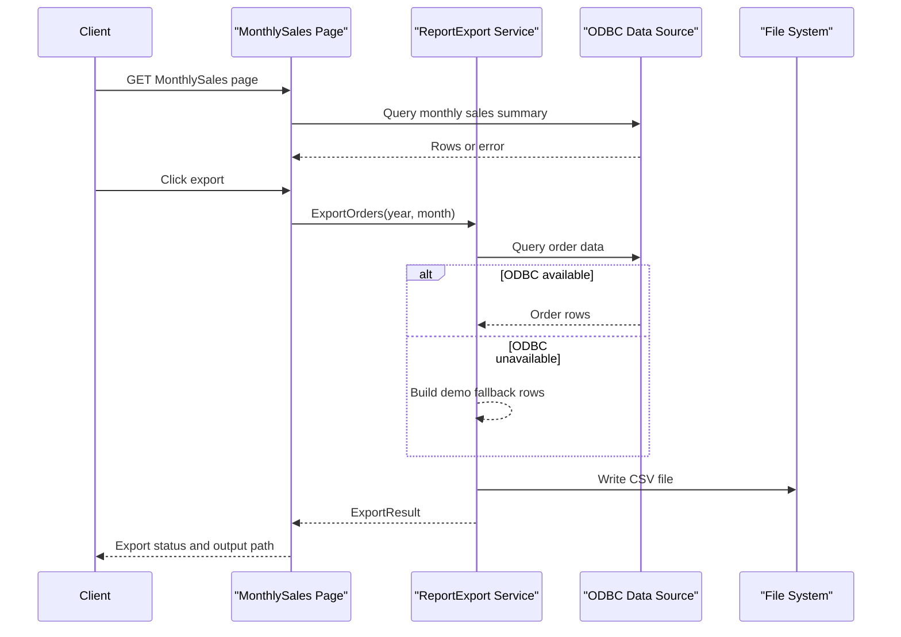

# API & Service Communication Contracts

This application exposes a minimal API surface with one Web Forms page flow and one ASMX service operation, using synchronous in-process and ODBC-backed communication.

## Service Catalog

| Service | Port | Category | Purpose |
|---|---|---|---|
| Reporting.Legacy.Web | 44330 (IIS Express default in README) | API Layer | Hosts Web Forms pages and legacy report export service |

## API Endpoints Inventory

| Service | Method | Path | Request Type | Response Type |
|---|---|---|---|---|
| Reporting.Legacy.Web | GET | /Default.aspx | Browser request, no body | HTML page |
| Reporting.Legacy.Web | GET | /Reports/MonthlySales.aspx | Browser request, no body | HTML page with grid data |
| Reporting.Legacy.Web | POST | /Services/ReportExport.asmx/ExportOrders | SOAP body with year, month integers | `ExportResult` DTO |

## Management & Observability Endpoints

| Service | Endpoint | Custom Metrics (if any) |
|---|---|---|
| Reporting.Legacy.Web | None explicitly configured | None detected |

## DTOs & Contracts

The primary contract model is `ExportResult` (response DTO) returned by the ASMX `ExportOrders` operation. Request contract parameters are primitive `int year` and `int month`. UI reporting uses `MonthlySalesRow` as a local view model for page rendering. DTOs are mutable classes and serialization follows default ASMX XML serializer behavior.

## Communication Patterns

Communication is synchronous: browser requests hit Web Forms pages, and Monthly Sales export delegates to in-process `ReportExport` service logic that performs synchronous ODBC queries and file writes. No asynchronous messaging, service discovery, retries, or circuit breaker policy is configured. Security posture is limited to Windows authentication mode in configuration with permissive local authorization (`allow users="*"`); no explicit TLS/authz policy is defined in code-level API contracts.

## Service Technology Matrix

| Service | Web | Data Access | Discovery | Gateway | Actuator | Cache | Metrics |
|---|---|---|---|---|---|---|---|
| Reporting.Legacy.Web | Web Forms + ASMX | ODBC (`System.Data.Odbc`) | None | None | None | None | EventLog only |

## Service Communication Sequence

