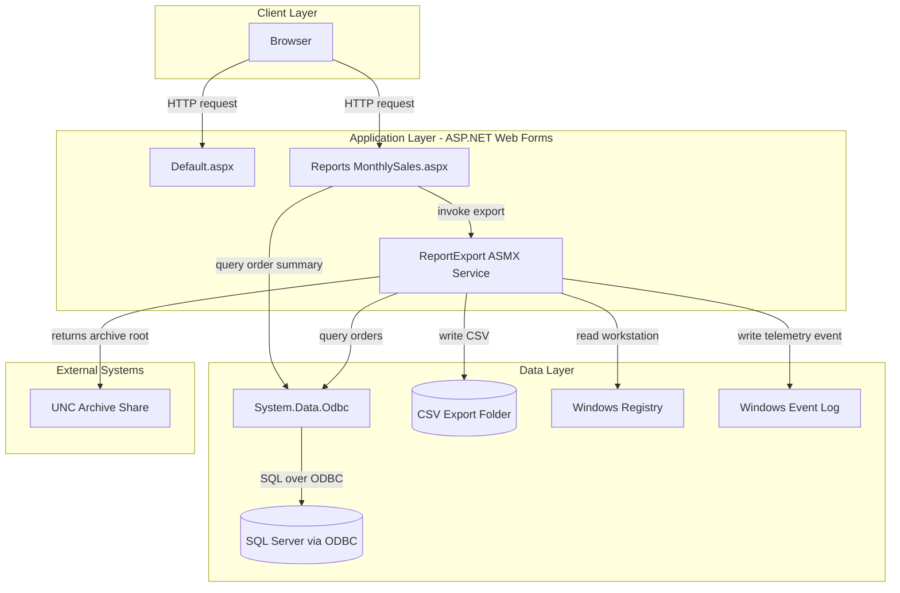
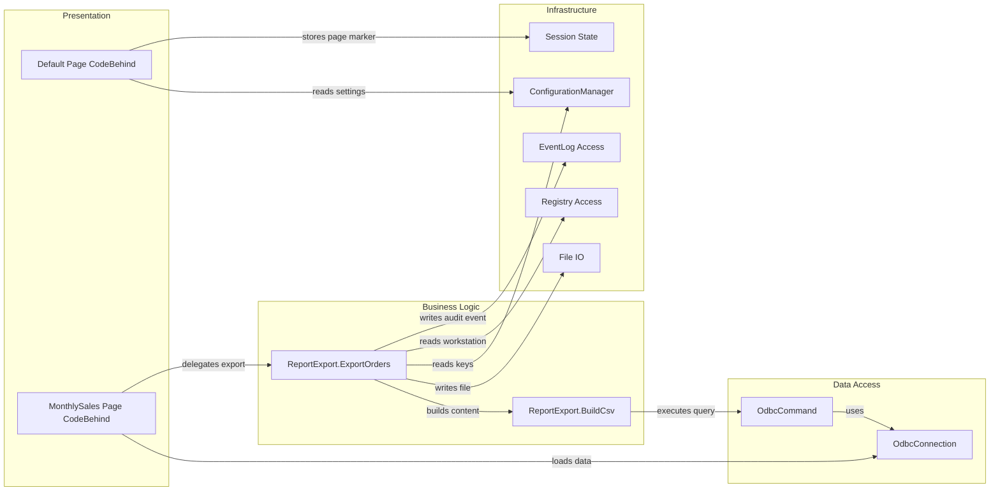

# Architecture Diagram

This document summarizes the current legacy reporting application structure and its key component relationships.

## Application Architecture



### Technology Stack Summary

| Layer | Technology | Version | Purpose |
|---|---|---|---|
| Presentation | ASP.NET Web Forms | .NET Framework 4.7.2 | UI pages for reporting and export trigger |
| Service | ASMX SOAP Web Service | .NET Framework 4.7.2 | ExportOrders operation for CSV generation |
| Data Access | System.Data.Odbc | .NET Framework BCL | Reads order/reporting data |
| Runtime | IIS Express / ASP.NET | Legacy .NET runtime | Hosts Web Forms and ASMX endpoints |

### Data Storage & External Services

The app reads reporting data from SQL Server through an ODBC connection string and writes export output to a local filesystem path. It also references a UNC archive path in configuration and interacts with Windows Registry/EventLog for environment and audit signals.

### Key Architectural Decisions

- Uses classic Web Forms UI plus ASMX service endpoint rather than ASP.NET MVC/Web API.
- Keeps ODBC as the primary data access mechanism to a legacy SQL source.
- Provides resilient demo fallback rows when live ODBC connectivity is unavailable.

## Component Relationships



### Component Inventory

| Component | Layer | Type | Responsibility |
|---|---|---|---|
| Default.aspx.cs | Presentation | Web Forms Page | Renders operator/reporting mode landing information |
| MonthlySales.aspx.cs | Presentation | Web Forms Page | Loads monthly sales rows and triggers export |
| ReportExport.asmx.cs | Business Logic | ASMX Web Service | Produces export metadata and writes report CSV |
| BuildCsv | Business Logic | Service Helper | Reads orders and converts to CSV rows with fallback |
| ConfigurationManager | Infrastructure | Config Provider | Supplies appSettings values from Web.config |
| OdbcConnection/OdbcCommand | Data Access | Data Access API | Executes SQL queries via ODBC |
| File/Directory APIs | Infrastructure | File System | Persists generated export files |
| Registry/EventLog APIs | Infrastructure | OS Integration | Reads machine setting and writes operational event |
```
