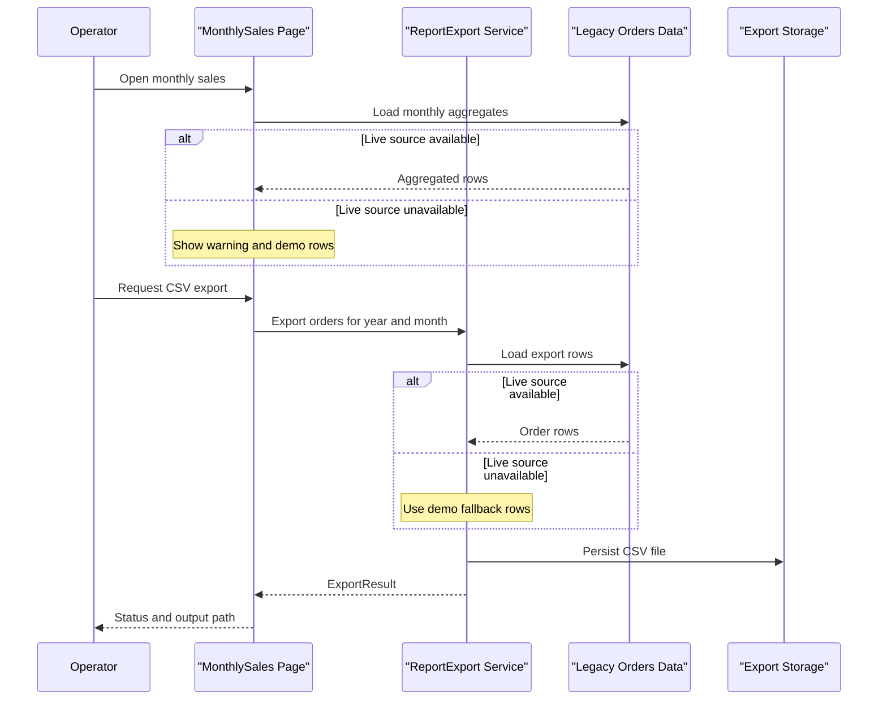

# Core Business Workflows

The application supports legacy operational reporting workflows: viewing monthly sales summaries and exporting monthly order files for downstream operators.

## Domain Entities

| Entity | Service / Bounded Context | Description | Key Relationships |
|---|---|---|---|
| MonthlySalesRow | Reporting UI | Aggregated sales view per customer for monthly report display | Derived from Orders reporting data |
| ExportResult | Reporting Export | Result contract for export operation outcome and output metadata | Produced by export workflow after CSV generation |
| Order (source record) | Legacy Reporting Data | Operational order data used as source for summary and export workflows | Feeds both summary and export paths |

## Service-to-Domain Mapping

| Service | Domain Context | Owned Entities | External Dependencies |
|---|---|---|---|
| Default page | Reporting Home | Session marker, operator context | AppSettings, authenticated user context |
| MonthlySales page | Sales Reporting | MonthlySalesRow | ODBC reporting source, ReportExport service |
| ReportExport ASMX | Report Distribution | ExportResult, CSV payload | ODBC reporting source, filesystem, registry, event log |

## Primary Workflows

### Workflow 1: View Monthly Sales Summary

1. Operator opens monthly sales page.
2. Page loads sales aggregate data from reporting source.
3. If source is unavailable, fallback demo rows are shown with warning message.
4. If no rows are returned, fallback demo rows are still shown to preserve continuity.

### Workflow 2: Export Monthly Orders CSV

1. Operator clicks export on monthly sales page.
2. Page invokes `ExportOrders(year, month)` in the export service.
3. Service reads configuration (export root, archive root, operator group).
4. Service builds CSV from order data; on source failure it emits demo fallback rows.
5. Service writes CSV to export folder and returns `ExportResult` metadata.

## Cross-Service Data Flows

The UI and export flows are in the same deployable service but cross module boundaries in-process: `MonthlySales` delegates export execution to `ReportExport`. Both workflows consume the same order source through ODBC. Fallback behavior degrades gracefully by returning demo content instead of failing the operator workflow.

## Business Workflow Sequence

## Business Rules & Decision Logic

- If live ODBC reporting is unreachable, workflows return demo fallback rows instead of hard failure.
- Export status always includes operator-group context from configuration.
- Session tracks last reporting page (`Default` or `MonthlySales`) for user continuity.
- Export workflow logs an operational event when possible; failure to write the event does not block business completion.
