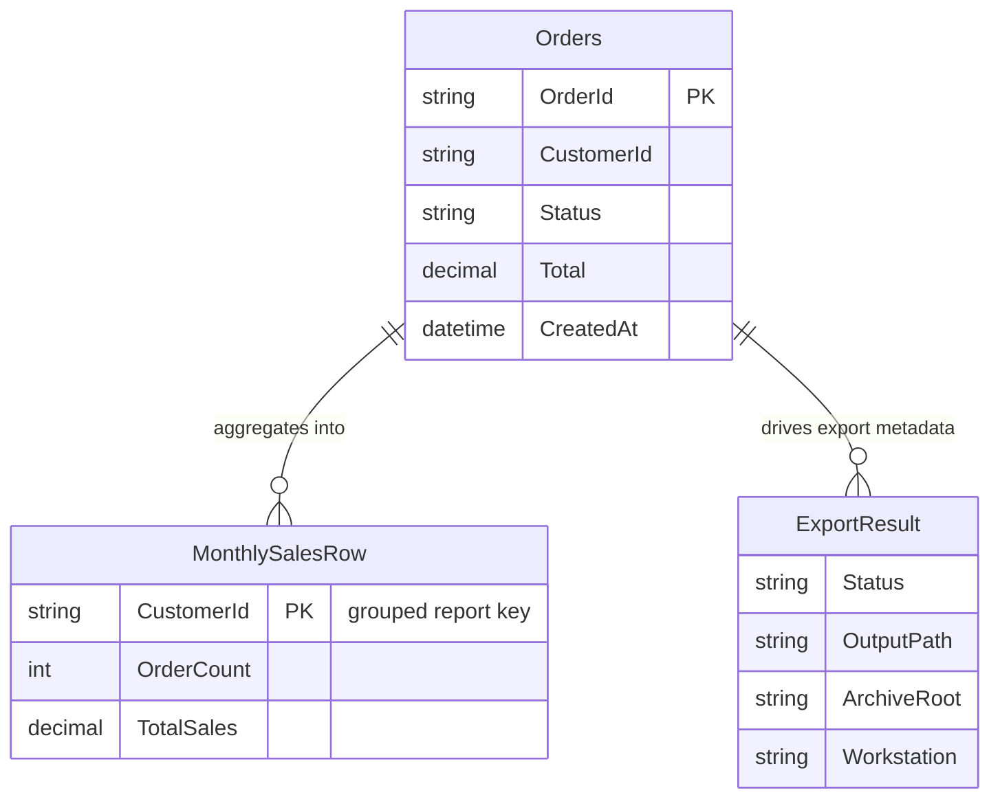

# Data Architecture & Persistence Layer

The data layer is centered on ODBC-based SQL access with lightweight in-memory view/export models and no ORM or migration framework.

## Database Configuration

| Service/Module | DB Type | Profile | Driver | Connection | Migration Tool |
|---|---|---|---|---|---|
| Reporting.Legacy.Web | SQL Server (via ODBC) | Default (Web.config) | ODBC Driver 17 for SQL Server | App setting `ReportingOdbcConnection` | None detected |

## Data Ownership per Service

| Service | Tables Owned | ORM Framework | Caching | Notes |
|---|---|---|---|---|
| Reporting.Legacy.Web | Reads `dbo.Orders` (reporting source) | None (raw ODBC) | None | CSV export output stored in filesystem |

## Entity Model

## Key Repository Methods

| Service | Repository | Notable Methods | Purpose |
|---|---|---|---|
| Reporting.Legacy.Web | Inline ODBC access in `Reports/MonthlySales.aspx.cs` | SQL aggregate query on `dbo.Orders` grouped by customer | Builds monthly sales page rows |
| Reporting.Legacy.Web | Inline ODBC access in `Services/ReportExport.asmx.cs` | SQL export query for `OrderId, CustomerId, Status, Total, CreatedAt` | Produces CSV export data |

## Caching Strategy

No explicit application caching provider or cache abstraction is configured. Resilience uses deterministic fallback demo rows when live ODBC reads fail or return no data.

## Data Ownership Boundaries

The application uses a single data source boundary (legacy SQL reporting database through ODBC) with no service-isolated stores. Cross-component access is in-process only: Web Forms pages and ASMX service each execute direct SQL through ODBC rather than accessing a separate data service.

### Data Classification & Sensitivity

| Entity | Sensitive Fields | Classification (PII/PHI/PCI/None) | Controls in Place |
|---|---|---|---|
| Orders | `CustomerId` (business identifier), possible operational order metadata | Internal / Potential PII-adjacent | No explicit encryption-at-rest or masking controls visible in app code/config |
| ExportResult | `Workstation`, `OutputPath`, `ArchiveRoot` | Internal system metadata | No explicit masking controls |
| MonthlySalesRow | `CustomerId`, aggregated totals | Internal business data | No explicit field-level controls |
