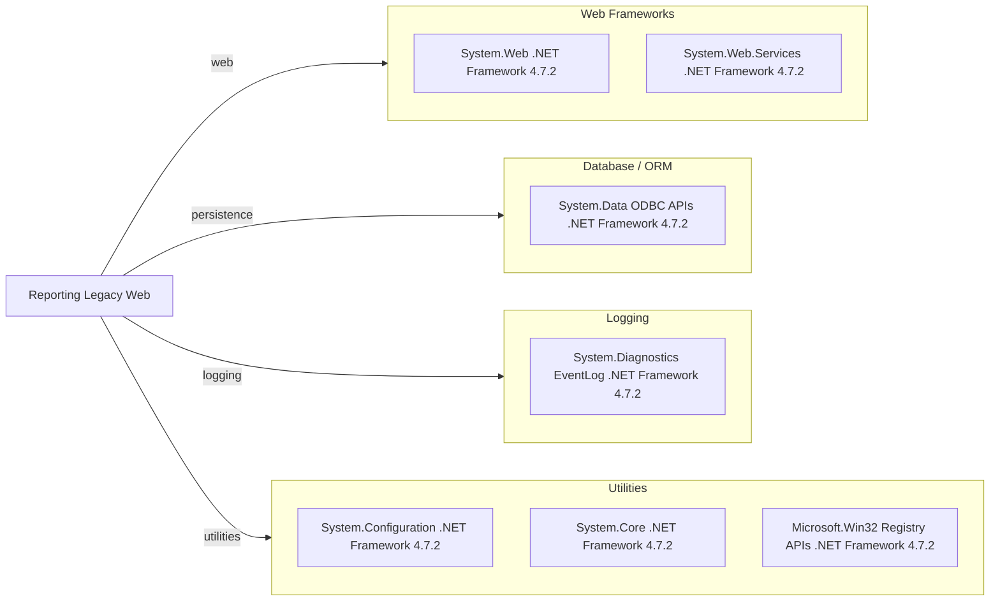

# Dependency Map

This project has a small declared dependency surface (0 external NuGet packages), relying primarily on .NET Framework assemblies and the ASP.NET Web Application project system.

## Dependencies

### Dependency Summary

| Category | Count | Key Libraries | Notes |
|---|---:|---|---|
| Web Frameworks | 2 | System.Web, System.Web.Services | Web Forms UI plus ASMX service stack |
| Database / ORM | 1 | System.Data | ODBC-based SQL access without ORM |
| Logging | 1 | System.Diagnostics | Uses Windows EventLog API |
| Utilities | 3 | System.Configuration, Microsoft.CSharp, System.Core | Runtime/config/support assemblies |

### Version & Compatibility Risks

The project targets .NET Framework 4.7.2, which is a legacy runtime compared with current .NET versions. The Web Forms and ASMX programming model is not directly supported on modern .NET, and ODBC-centric data access may require adapter or rewrite planning during migration.

### Notable Observations

- `packages.config` is empty, so package-level ecosystem visibility is limited and most dependencies are framework references.
- The project relies on legacy ASP.NET Web Application targets (`Microsoft.WebApplication.targets`).
- ODBC and Windows-specific APIs (Registry/EventLog) increase platform coupling.

## Test Dependencies

| Framework | Version | Notes |
|---|---|---|
| None detected | N/A | No test-scoped dependencies declared |

Total test-scope dependencies: 0
No test dependencies detected.
